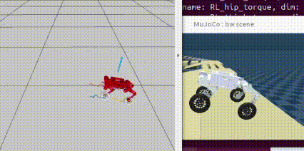
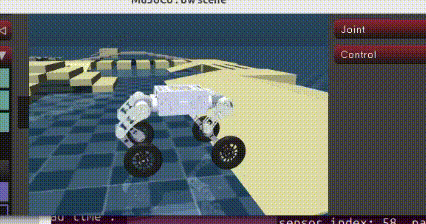
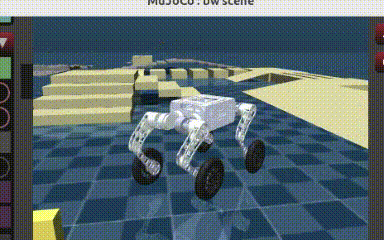

# Quadruped ROS2 Control

This repository contains a simplified ros2-control based stack for Unitree quadruped robots.

* [Controllers](controllers): OCS2 and RL ros2-control controllers
* [Commands](commands): joystick command input and shared input message
* [Descriptions](descriptions): Unitree URDF/Xacro robot models and controller configs
* [Hardwares](hardwares): Unitree SDK2 ros2-control hardware interface

> **Warning:** Default branch was developed under ROS2 Jazzy. For ROS2 Humble, please check out **humble** branch.

## Simplified scope

This local copy was pruned on 2026-06-25. It keeps the standard ROS joystick input path, OCS2/RL controllers, Unitree SDK2 hardware interface, and Unitree robot descriptions. Gazebo/GZ simulation support has been removed; use the Unitree Mujoco simulator or real Unitree SDK2 transport instead. Removed package groups and rollback instructions are recorded in [SIMPLIFICATION_CHANGES.md](SIMPLIFICATION_CHANGES.md).

## 1. Quick Start

* Install dependencies
  ```bash
  cd ~/ros2_ws
  rosdep install --from-paths src --ignore-src -r -y
  ```

* Build the common OCS2/RL stack
  ```bash
  cd ~/ros2_ws
  colcon build --packages-up-to joystick_input ocs2_quadruped_controller rl_quadruped_controller bw_description --symlink-install
  ```

### 1.1 Joystick input

The kept command input path uses the standard ROS `joy` node plus `joystick_input`:

```bash
source ~/ros2_ws/install/setup.bash
ros2 launch joystick_input joystick.launch.py
```

The node publishes `control_input_msgs/msg/Inputs` on `/control_input`.

### 1.2 Mujoco Simulator or Real Unitree Robot

> **Warning:** CycloneDDS ROS2 RMW may conflict with Unitree SDK2. If you cannot launch Unitree Mujoco simulation without `sudo`, use another ROS2 RMW such as FastDDS, or follow the Unitree ROS2 RMW guide.

* Compile Unitree hardware interfaces when using Mujoco/real robot transport:
  ```bash
  cd ~/ros2_ws
  colcon build --packages-up-to hardware_unitree_sdk2
  ```
* Follow the guide in [unitree_mujoco](https://github.com/legubiao/unitree_mujoco) to launch the Unitree Mujoco simulation.
* Launch a kept controller:
  ```bash
  source ~/ros2_ws/install/setup.bash
  ros2 launch ocs2_quadruped_controller mujoco.launch.py pkg_description:=bw_description
  # or
  ros2 launch rl_quadruped_controller mujoco.launch.py pkg_description:=bw_description
  ```


## Demos

### Terrain estimation



### Online gait



### Online gait



For more details, see [OCS2 Quadruped Controller](controllers/ocs2_quadruped_controller/), [RL Quadruped Controller](controllers/rl_quadruped_controller/), and [BW robot description](descriptions/my_dog/bw_description/).

## Attribution and Copyright Notice

This repository is a modified fork based on [legubiao/quadruped_ros2_control](https://github.com/legubiao/quadruped_ros2_control). Original copyrights, license terms, authorship notices, and third-party dependency notices belong to their respective owners and should be retained when redistributing this fork.

This fork contains project-specific modifications, including the custom BW robot description, controller configuration updates, Unitree Mujoco / SDK2 workflow updates, README cleanup, and removal of Gazebo/GZ simulation support.

The controller and gait-generation work in this repository also refers to the paper *Whole-Body MPC and Online Gait Sequence Generation for Wheeled-Legged Robots*. The paper and its figures, text, and associated intellectual property belong to their original authors/publisher; this repository only references the paper as related academic background.

## What's Next

* **Custom robot description** is available in [descriptions/my_dog/bw_description](descriptions/my_dog/bw_description/).
* **Try kept controllers**
  * [OCS2 Quadruped Controller](controllers/ocs2_quadruped_controller): MPC-based controller for quadruped robots
  * [RL Quadruped Controller](controllers/rl_quadruped_controller): reinforcement-learning controller for quadruped robots
* **Real Robot Deploy**
  * [BW Robot](descriptions/my_dog/bw_description): deployment notes for the custom robot description

## Reference

### Conference Paper

[1] Liao, Qiayuan, et al. "Walking in narrow spaces: Safety-critical locomotion control for quadrupedal robots with duality-based optimization." In *2023 IEEE/RSJ International Conference on Intelligent Robots and Systems (IROS)*, pp. 2723-2730. IEEE, 2023.

### Miscellaneous

[1] Qiayuan Liao. *legged_control: An open-source NMPC, WBC, state estimation, and sim2real framework for legged robots*. [Online]. Available: [https://github.com/qiayuanl/legged_control](https://github.com/qiayuanl/legged_control)

[2] Ziqi Fan. *rl_sar: Simulation Verification and Physical Deployment of Robot Reinforcement Learning Algorithm.* 2024. Available: [https://github.com/fan-ziqi/rl_sar](https://github.com/fan-ziqi/rl_sar)
